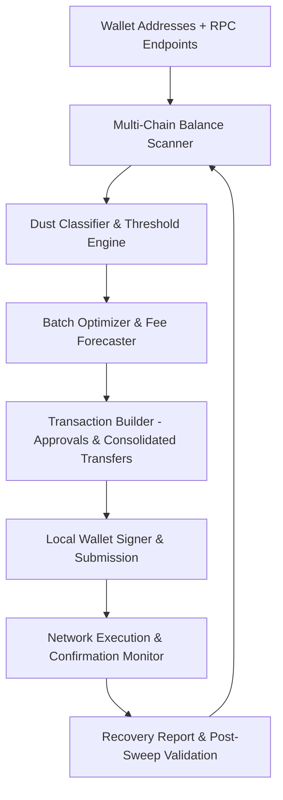

# Dust Sweeper v2026

Deploy Dust Sweeper for automated detection and sweeping of uneconomical token dust across EVM, Solana, and multi-chain wallets. Low-gas batch execution, threshold optimization, and non-custodial routing layer for efficient portfolio cleanup and capital recovery.

### Introduction

Dust Sweeper operates as a specialized consolidation and recovery execution environment for cryptocurrency wallets. It scans addresses for small, uneconomical token balances (“dust”) that are below viable transfer thresholds due to gas or network fees, then aggregates and sweeps them to a designated main wallet using optimized batching, gas strategies, and multi-chain routing. The system functions non-custodially, signing transactions locally while minimizing overall fee expenditure.

In 2026’s multi-chain landscape, where users accumulate dust across hundreds of tokens and networks, this tool serves as a practical maintenance layer that recovers otherwise locked capital and streamlines portfolio hygiene.

### Inside the System: Core Mechanism

Dust Sweeper functions as a balance scanner and batch transaction engine. It queries wallet balances via RPC/indexer endpoints, applies configurable dust thresholds per token and chain, groups compatible transfers, constructs optimized batched transactions (where supported), and submits them with dynamic gas/priority fee logic. It accounts for token decimals, approval requirements, and network-specific constraints to maximize net recovery.

Key layers include:
- **Scanner Module**: Multi-chain balance discovery and dust classification.
- **Optimization Engine**: Batch grouping, route selection, and fee forecasting.
- **Execution Router**: Local signing with slippage protection and retry mechanisms.
- **Telemetry Layer**: Recovery logs, fee efficiency metrics, and post-sweep verification.

  

### Target Audience and Operational Use Cases

Active DeFi users, portfolio managers, multi-wallet operators, and cleanup-focused traders benefit most. Typical scenarios include:
- Consolidating dust from hundreds of airdrop/testnet tokens across EVM chains.
- Sweeping small Solana token balances after trading or farming.
- Periodic maintenance of hardware or cold storage wallets.
- Institutional or team wallet hygiene before tax reporting or audits.
- Recovering value from abandoned or legacy addresses.

The system suits users comfortable with wallet management and basic configuration.

### Technical Architecture and Workflow

Dust Sweeper employs a modular, read-and-execute design:
1. **Wallet Ingestion**: Loads source and destination addresses with RPC configuration.
2. **Dust Detection**: Threshold-based scanning with price oracle integration.
3. **Batch Planning**: Groups transfers to minimize per-transaction overhead.
4. **Transaction Builder**: Constructs calls with gas optimization and approvals.
5. **Safe Execution**: Local signing, simulation, and confirmation tracking.

**Operational Logic**

This loop enables efficient, repeatable consolidation with minimal manual intervention.

### Key Features and Performance Considerations

- **Multi-Chain Support**: EVM (Ethereum, L2s), Solana, and select others with native batching where available.
- **Intelligent Thresholds**: Dynamic dust detection based on current gas prices and token value.
- **Gas Optimization**: Batching, nonce management, and priority fee tuning.
- **Non-Custodial Operation**: All private keys remain under user control.
- **Logging & Export**: Detailed recovery reports for accounting and audit trails.

**Optimization Note**: Recovery efficiency varies with network fees, token liquidity, and batch compatibility. High gas periods may make even optimized sweeps uneconomical — always preview operations.

### Where It Fits in the Market: Positioning

Dust Sweeper focuses on practical capital recovery and maintenance, positioned between generic transfer tools and full portfolio managers.

| Aspect              | Dust Sweeper           | Manual Transfers      | Portfolio Trackers    | General Bots         |
|---------------------|------------------------|-----------------------|-----------------------|----------------------|
| Execution Efficiency| High (batched)        | Low                   | Monitoring only       | Variable            |
| Fee Optimization    | Strong                | None                  | None                  | Moderate            |
| Multi-Chain Depth   | Excellent             | Tedious               | Good                  | Variable            |
| Ease of Use         | Intermediate          | Expert                | User-friendly         | Intermediate        |
| Risk Management     | Preview & thresholds  | Manual                | Basic                 | Configurable        |
| Best Use Case       | Dust consolidation    | One-off moves         | Overview              | Broader automation  |

### Risk Surface and Limitations

- **Execution Risk**: Failed batches or misconfigured thresholds can waste gas.
- **Approval & Smart Contract Exposure**: Interacting with many token contracts carries minor risks.
- **Tax Implications**: Sweeping may trigger taxable events depending on jurisdiction.
- **Wallet Security**: Requires careful key management for source addresses.
- **No Guarantees**: Some dust remains unprofitable to sweep regardless of optimization.

Always preview transactions and use small test runs first.

### Deployment Notes

1. Prepare source and destination wallets with sufficient gas/native tokens.
2. Configure RPC endpoints, dust thresholds, and batch preferences via config file or CLI.
3. Run initial scan to preview recoverable value and estimated costs.
4. Execute in stages, monitoring confirmations and adjusting parameters.
5. Export recovery logs for record-keeping.

For automation, integrate into cron jobs or persistent scripts with safety pauses. Validate all addresses and simulate where possible.

### Conclusion

Dust Sweeper provides a targeted execution layer for recovering and consolidating fragmented token balances across blockchain networks. Through intelligent scanning, batch optimization, and non-custodial transaction handling, it helps maintain clean, efficient portfolios while minimizing unnecessary fee leakage. Operators achieve best results with proper threshold configuration, periodic usage, and integration into broader wallet hygiene practices. Treat it as practical maintenance infrastructure — effective for capital preservation when applied with realistic fee awareness and secure operational habits.

### FAQ

**Is Dust Sweeper safe to use?**  
Non-custodial design keeps keys under user control. Safety depends on verified code, careful address configuration, and transaction previews. Always run on trusted environments.

**Does it support batching on Solana and EVM chains?**  
Yes. It leverages native batch instructions or multi-call patterns where available to reduce per-transaction overhead.

**Is it suitable for beginners?**  
Basic scans and single-wallet sweeps are approachable, but optimal multi-chain usage benefits from understanding of gas fees and wallet security.

**How does it compare to manual sweeping?**  
Automation handles detection, batching, and optimization at scale, saving significant time and reducing human error compared to manual transfers.

**What are the primary risks?**  
Wasted gas on unprofitable sweeps, incorrect destination addresses, smart contract interaction risks, and tax reporting obligations. Preview all operations and maintain secure backups.
